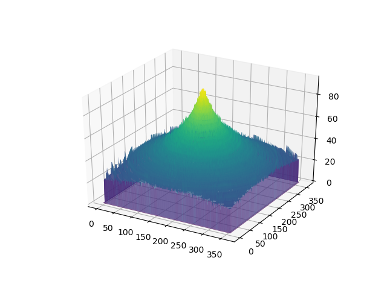
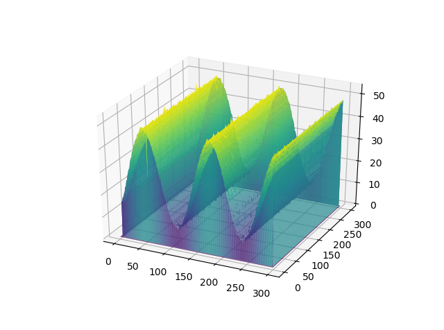

# Shape from Focus 

This repository includes an implementation code of the shape from focus using the sum of modified Laplacian as a focus measurement developed by [Shree K. Nayar, Y. Nakagawa](https://ieeexplore.ieee.org/document/308479) in 1994.

The used image stacks captured with different focus levels were made by synthetic images. 

In this code, I just excepted the interpolation method so as to simplify implementation (just stacking up indices by argmax along each pixel sequence).

    
